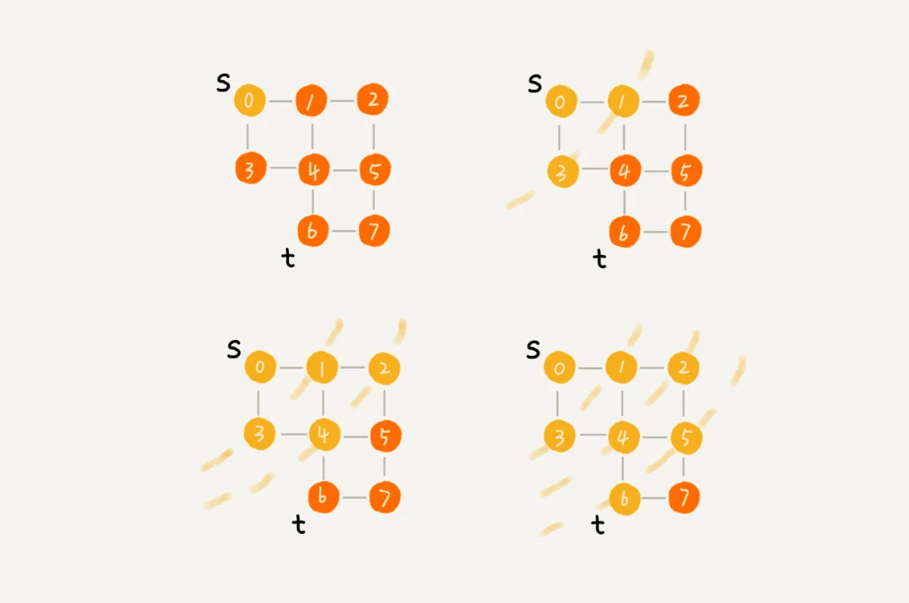
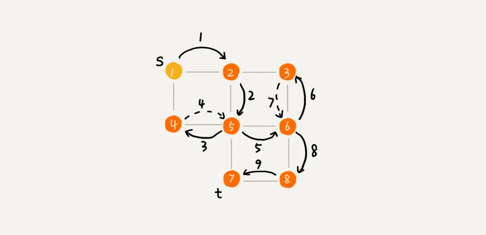

# 深度和广度优先搜索

> 算法是作用于具体数据结构之上的。

深度优先搜索算法和广度优先搜索算法都是基于「图」这种数据结构的。「树」可以视为特殊的图。

## 广度优先算法（BFS）



- 借助队列来存储每一层的待处理顶点。
- 借助集合来避免多次处理同一个顶点。

```go
func BFS(g Graph, start int, visit func(vertex *Vertex) bool) error {
    startVertex := g.getVertex(start)
    if startVertex == nil {
        return fmt.Errorf("invalid vertex key : %v", start)
    }

    // 初始化队列和已访问集合
    queue := []*Vertex{startVertex}
    visited := make(map[*Vertex]struct{})

    // 循环遍历直到队列为空
    for len(queue) > 0 {

        // 出队一个元素
        curVertex := queue[0]
        queue = queue[1:]

        // 已处理过的直接跳过
        if _, ok := visited[curVertex]; ok {
            continue
        }

        // 处理并标记已处理
        visited[curVertex] = struct{}{}
        if stop := visit(curVertex); stop {
            break
        }

        // 将当前节点的下一层顶点入队
        queue = append(queue, curVertex.adjacent...)
    }

    return nil
}
```

## 深度优先算法（DFS）



- 借助栈来存储每一层的待处理顶点。
- 借助集合来避免多次处理同一个顶点。

非递归写法：
```go
func DFS(g Graph, start int, visit func(vertex *Vertex) bool) error {
    startVertex := g.getVertex(start)
    if startVertex == nil {
        return fmt.Errorf("invalid vertex key : %v", start)
    }

    // 初始化栈和已访问集合
    stack := []*Vertex{startVertex}
    visited := make(map[*Vertex]struct{})

    // 循环遍历直到栈为空
    for len(stack) > 0 {
        // 出栈一个元素
        curVertex := stack[len(stack)-1]
        stack = stack[:len(stack)-1]

        // 已处理过的直接跳过
        if _, ok := visited[curVertex]; ok {
            continue
        }

        // 处理并标记已处理
        visited[curVertex] = struct{}{}
        if stop := visit(curVertex); stop {
            break
        }

        // 下层顶点入栈
        stack = append(stack, curVertex.adjacent...)
    }

    return nil
}
```

既然深度优先搜索可以借助「栈」实现，那岂不是可以用内置栈即「递归」来实现？

递归写法：
```go
var visited = make(map[*Vertex]struct{})

func DFS(g Graph, start int, visit func(vertex *Vertex) bool) error {
    startVertex := g.getVertex(start)
    if startVertex == nil {
        return fmt.Errorf("invalid vertex key : %v", start)
    }

    curVertex := startVertex
    if _, ok := visited[curVertex]; ok {
        return nil
    }

    visited[curVertex] = struct{}{}
    if stop := visit(curVertex); stop {
        return nil
    }

    for _, v := range curVertex.adjacent {
        if err := DFS(g, v.key, visit); err != nil {
            return err
        }
    }

    return nil
}
```

## Letcode Problems

- [二叉树的层次遍历](https://leetcode.cn/problems/binary-tree-level-order-traversal/#/description)
- [在每个树行中找最大值](https://leetcode.cn/problems/find-largest-value-in-each-tree-row/)

### 网格类

- [岛屿数量](https://leetcode.cn/problems/number-of-islands/)
