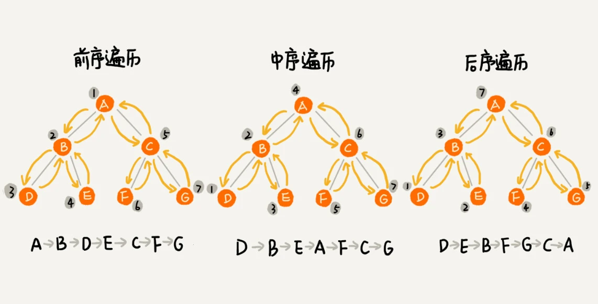

# 二叉树（Binary Tree）

## 树（Tree）的三个概念


- 节点的高度 = 节点到叶子节点的**最长路径**（边数）
- 节点的深度 = 根节点到这个节点**所经历的边的个数**
- 节点的层数 = 节点的深度 + 1
- 树的高度 = 根节点的高度

## 二叉树的定义

树中每个节点**最多**有两个子节点，分别是**左子节点**和**右子节点**。


叶子节点都在最底下两层，最后一层的叶子节点都靠左排列，并且除了最后一层，其他层的节点个数都要达到最大，这种二叉树叫做 **完全二叉树**。

叶子节点全都在最底层，除了叶子节点之外，每个节点都有左右两个子节点，这种二叉树就叫做 **满二叉树**。

## 存储二叉树

想要存储一棵二叉树，有两种方法，一种是基于指针的二叉**链式存储法**，一种是基于数组的**顺序存储法**

### 链式存储法


每个节点有三个字段，其中一个存储数据，另外两个是指向左右子节点的指针。我们只要拎住根节点，就可以通过左右子节点的指针，把整棵树都串起来。

### 顺序存储法


如果节点 X 存储在数组中下标为 i 的位置，下标为 2 * i 的位置存储的就是左子节点，下标为 2 * i + 1 的位置存储的就是右子节点。反过来，下标为 i/2 的位置存储就是它的父节点。通过这种方式，我们只要知道根节点存储的位置（一般情况下，为了方便计算子节点，根节点会存储在下标为 1 的位置），这样就可以通过下标计算，把整棵树都串起来。

如果某棵二叉树是一棵完全二叉树，那用数组存储无疑是最节省内存的一种方式。

## 遍历二叉树

- **前序遍历**是指，对于树中的任意节点来说，先访问这个节点，然后再访问它的左子树，最后访问它的右子树。
- **中序遍历**是指，对于树中的任意节点来说，先访问它的左子树，然后再访问它本身，最后访问它的右子树。
- **后序遍历**是指，对于树中的任意节点来说，先访问它的左子树，然后再访问它的右子树，最后访问这个节点本身



**二叉树的前、中、后序遍历就是一个递归的过程**。递推公式如下：

```shell
前序遍历的递推公式：
preOrder(r) = print r -> preOrder(r.left) -> preOrder(r.right)

中序遍历的递推公式：
inOrder(r) = inOrder(r.left) ->print r -> inOrder(r.right)

后序遍历的递推公式：
postOrder(r) = postOrder(r.left) -> postOrder(r.right) -> print r
```

根据遍历顺序图可以看出来，每个节点最多会被访问两次，所以遍历操作的时间复杂度，跟节点的个数 n 成正比，也就是说二叉树遍历的时间复杂度是 O(n)。