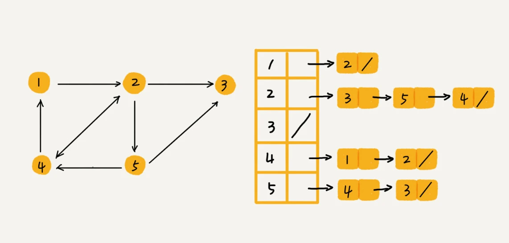
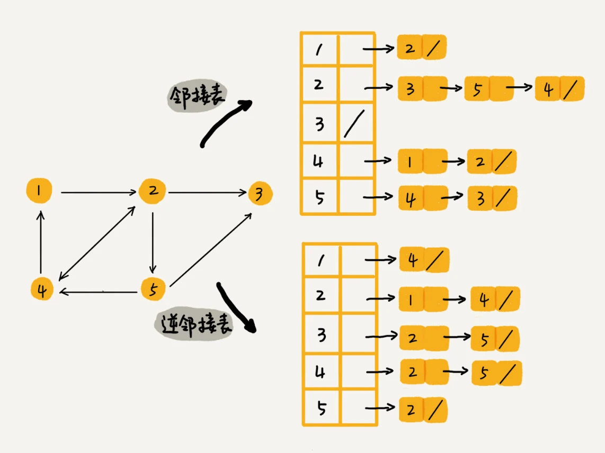
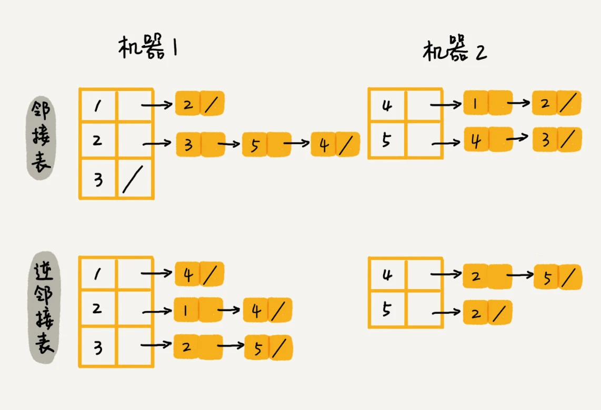
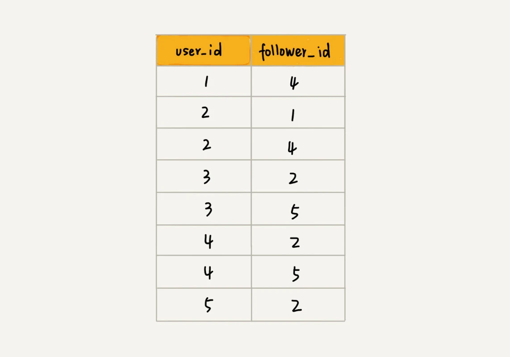

# 图（Graph）

## 图的定义

图是一种非线性表数据结构，由顶点和边构成。

### 相关概念

- 图中的元素我们就叫做**顶点**（vertex）。
- 一个顶点与任意其他顶点建立的连接关系叫做**边**（edge）。
- 顶点相连接的边的条数叫做顶点的**度**（degree）。
- 边有方向的图，叫做**有向图**。
- 边没有方向的图就叫做**无向图**。
- 无向图中有“**度**”这个概念，表示一个顶点有多少条边。
- 在有向图中，我们把度分为**入度**（In-degree）和**出度**（Out-degree）。
- **带权图**（weighted graph）每条边都有一个**权重**（weight）。

## 如何存储

### 邻接矩阵（Adjacency Matrix）存储法


邻接矩阵的底层依赖一个二维数组。对于无向图来说，如果顶点 i 与顶点 j 之间有边，我们就将 A[i][j]和 A[j][i]标记为 1；对于有向图来说，如果顶点 i 到顶点 j 之间，有一条箭头从顶点 i 指向顶点 j 的边，那我们就将 A[i][j]标记为 1。同理，如果有一条箭头从顶点 j 指向顶点 i 的边，我们就将 A[j][i]标记为 1。对于带权图，数组中就存储相应的权重。

- 缺点：浪费空间，无向图浪费一半，稀疏图（顶点很多，但每个顶点的边并不多）会浪费大量空间。
- 优点：
    - 因为基于数组，所以在获取两个顶点的关系时，就非常高效。
    - 方便计算。

### 邻接表（Adjacency List）存储法



每个顶点对应一条链表，链表中存储的是与这个顶点相连接的其他顶点。图中画的是一个有向图的邻接表存储方式，每个顶点对应的链表里面，存储的是指向的顶点。对于无向图来说，也是类似的，不过，每个顶点的链表中存储的，是跟这个顶点有边相连的顶点。

- 缺点：查询两个顶点之间的关系就没那么高效。
- 优点：节省空间

我们可以将邻接表中的**链表**改成**平衡二叉查找树**。实际开发中，我们可以选择用**红黑树**。这样，我们就可以更加快速地查找两个顶点之间是否存在边了。当然，这里的二叉查找树可以换成其他动态数据结构，比如**跳表**、**散列表**等。除此之外，我们还可以将链表改成**有序动态数组**，可以通过二分查找的方法来快速定位两个顶点之间否是存在边。

<details>
<summary>使用 Go 实现图</summary>

```go
// Graph represents a adjacency list graph
type Graph struct {
    vertices []*Vertex
}

// Vertex represents a graph vertex
type Vertex struct {
    key      int
    adjacent []*Vertex
}

// AddVertex adds a Vertex to the Graph
func (g *Graph) AddVertex(k int) error {
    if contains(g.vertices, k) {
        return fmt.Errorf("vertex %v not added because it is an existing key", k)
    }
    g.vertices = append(g.vertices, &Vertex{key: k})
    return nil
}

// AddEdge adds an edge to the graph
func (g *Graph) AddEdge(from, to int) error {
    // get vertex
    fromVertex := g.getVertex(from)
    toVertex := g.getVertex(to)
    // check error
    if fromVertex == nil || toVertex == nil {
        return fmt.Errorf("invalid edge (%v-->%v)", from, to)
    }
    // add edge
    if contains(fromVertex.adjacent, to) {
        return fmt.Errorf("existing edge (%v-->%v) ", from, to)
    }
    fromVertex.adjacent = append(fromVertex.adjacent, toVertex)
    return nil
}

// getVertex
// todo 可以优化查找方式
func (g *Graph) getVertex(k int) *Vertex {
    for i, v := range g.vertices {
        if v.key == k {
            return g.vertices[i]
        }
    }
    return nil
}

// contains
func contains(s []*Vertex, k int) bool {
    for _, v := range s {
        if k == v.key {
            return true
        }
    }
    return false
}

// Print will print the adjacent list for each vertex of the graph
func (g *Graph) Print() {
    for _, v := range g.vertices {
        fmt.Printf("\nVertex %v : ", v.key)
        for _, v := range v.adjacent {
            fmt.Printf(" %v ", v.key)
        }
    }
    fmt.Println()
}
```
</details>


## 图的应用

```
设计微博的关注关系存储模型

假设我们需要支持：
- 判断用户 A 是否关注了用户 B；
- 判断用户 A 是否是用户 B 的粉丝；
- 用户 A 关注用户 B；
- 用户 A 取消关注用户 B；
- 根据用户名称的首字母排序，分页获取用户的粉丝列表；
- 根据用户名称的首字母排序，分页获取用户的关注列表。
```
因为社交网络是一张稀疏图，使用邻接矩阵存储比较浪费存储空间。所以，采用邻接表来存储。

不过，用一个邻接表来存储这种有向图是不够的。我们去查找某个用户关注了哪些用户非常容易，但是如果要想知道某个用户都被哪些用户关注了，也就是用户的粉丝列表，是非常困难的。基于此，我们需要一个逆邻接表。

**邻接表中存储了用户的关注关系，逆邻接表中存储的是用户的被关注关系**。对应到图上，邻接表中，每个顶点的链表中，存储的就是这个顶点指向的顶点，逆邻接表中，每个顶点的链表中，存储的是指向这个顶点的顶点。如果要查找某个用户关注了哪些用户，我们可以在邻接表中查找；如果要查找某个用户被哪些用户关注了，我们从逆邻接表中查找。



基础的邻接表不适合快速判断两个用户之间是否是关注与被关注的关系，所以我们选择改进版本，将邻接表中的链表改为支持快速查找的动态数据结构。选择哪种动态数据结构呢？红黑树、跳表、有序动态数组还是散列表呢？

因为**需要按照用户名称的首字母排序，分页来获取用户的粉丝列表或者关注列表，用跳表这种结构再合适不过了**。这是因为，跳表插入、删除、查找都非常高效，时间复杂度是 O(logn)，空间复杂度上稍高，是 O(n)。最重要的一点，跳表中存储的数据本来就是有序的了，分页获取粉丝列表或关注列表，就非常高效。

如果对于小规模的数据，比如社交网络中只有几万、几十万个用户，我们可以将整个社交关系存储在内存中，上面的解决思路是没有问题的。但是如果像微博那样有上亿的用户，数据规模太大，我们就无法全部存储在内存中了。这个时候该怎么办呢？



可以**通过哈希算法等数据分片方式，将邻接表存储在不同的机器上**。如图在机器 1 上存储顶点 1，2，3 的邻接表，在机器 2 上，存储顶点 4，5 的邻接表。逆邻接表的处理方式也一样。当要查询顶点与顶点关系的时候，我们就利用同样的哈希算法，先定位顶点所在的机器，然后再在相应的机器上查找。

除此之外，还有另外一种解决思路，就是**利用外部存储**（比如硬盘），因为外部存储的存储空间要比内存会宽裕很多。数据库是我们经常用来持久化存储关系数据的，所以我这里介绍一种数据库的存储方式。为了高效地支持前面定义的操作，我们可以在表上建立多个索引，比如第一列、第二列，给这两列都建立索引。


