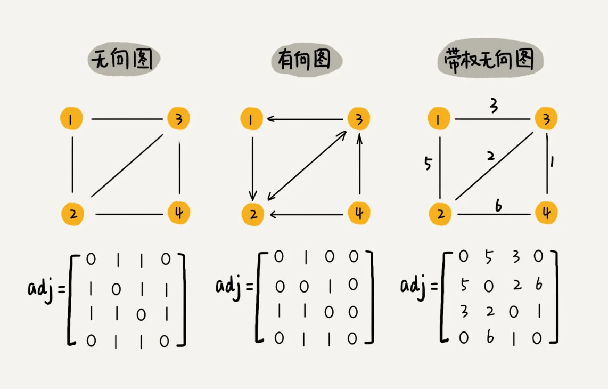

# 图（Graph）

## 图相关概念

- 图中的元素我们就叫做**顶点**（vertex）。
- 一个顶点与任意其他顶点建立的连接关系叫做**边**（edge）。
- 顶点相连接的边的条数叫做顶点的**度**（degree）。
- 边有方向的图，叫做**有向图**。
- 边没有方向的图就叫做**无向图**。
- 无向图中有“**度**”这个概念，表示一个顶点有多少条边。
- 在有向图中，我们把度分为**入度**（In-degree）和**出度**（Out-degree）。
- **带权图**（weighted graph）每条边都有一个**权重**（weight）。

## 如何存储

### 邻接矩阵（Adjacency Matrix）存储法

邻接矩阵的底层依赖一个二维数组。对于无向图来说，如果顶点 i 与顶点 j 之间有边，我们就将 A[i][j]和 A[j][i]标记为 1；对于有向图来说，如果顶点 i 到顶点 j 之间，有一条箭头从顶点 i 指向顶点 j 的边，那我们就将 A[i][j]标记为 1。同理，如果有一条箭头从顶点 j 指向顶点 i 的边，我们就将 A[j][i]标记为 1。对于带权图，数组中就存储相应的权重。

缺点：
- 浪费空间，无向图浪费一半，稀疏图（顶点很多，但每个顶点的边并不多）会浪费大量空间。

优点：
- 因为基于数组，所以在获取两个顶点的关系时，就非常高效。
- 方便计算。

### 邻接表（Adjacency List）存储法

每个顶点对应一条链表，链表中存储的是与这个顶点相连接的其他顶点。图中画的是一个有向图的邻接表存储方式，每个顶点对应的链表里面，存储的是指向的顶点。对于无向图来说，也是类似的，不过，每个顶点的链表中存储的，是跟这个顶点有边相连的顶点。

缺点：
- 查询两个顶点之间的关系就没那么高效。

优点：
- 节省空间

我们可以将邻接表中的**链表**改成**平衡二叉查找树**。实际开发中，我们可以选择用**红黑树**。这样，我们就可以更加快速地查找两个顶点之间是否存在边了。当然，这里的二叉查找树可以换成其他动态数据结构，比如**跳表**、**散列表**等。除此之外，我们还可以将链表改成**有序动态数组**，可以通过二分查找的方法来快速定位两个顶点之间否是存在边。

