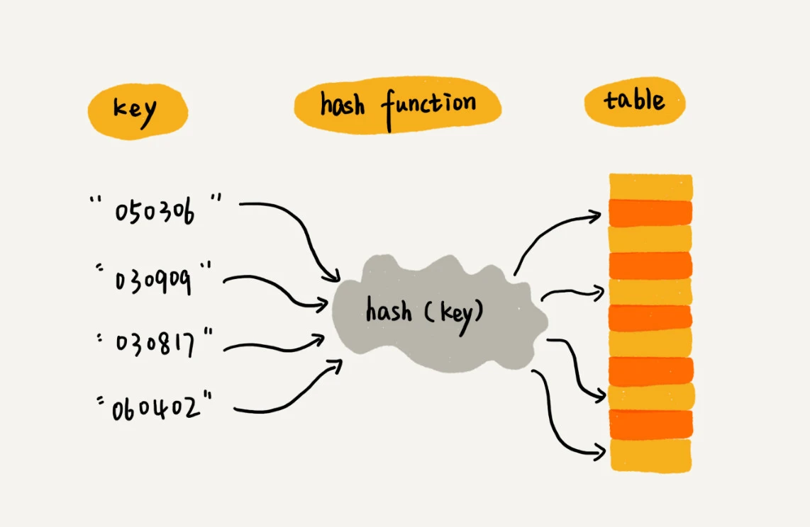
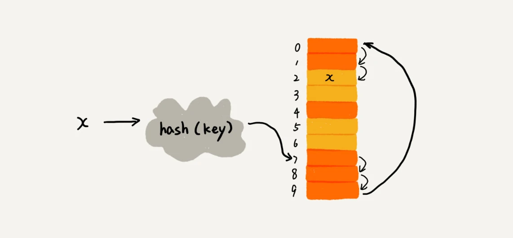
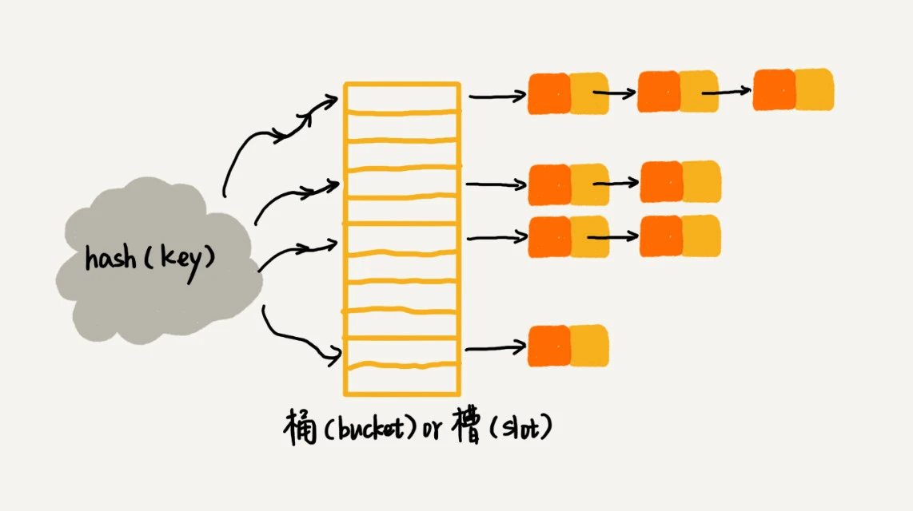

# 散列表（Hash Table）

- [散列表（Hash Table）](#散列表hash-table)
  - [定义](#定义)
  - [散列函数](#散列函数)
  - [散列冲突](#散列冲突)
    - [1. 开发寻址法](#1-开发寻址法)
    - [2. 拉链法](#2-拉链法)
  - [参考资料](#参考资料)

## 定义

散列表是一种用来映射 **键（Key）** 与 **值（Value）** 的抽象数据结构。它使用 **散列函数（Hash function）** 计算出的一个 **散列值（hash code）** 作为 **索引**，在存储数据的 **桶（buckets）数组** 中寻找值。



散列表用的就是数组支持按照下标随机访问，且时间复杂度是 `O(1)` 的特性。我们通过散列函数把元素的键值映射为下标，然后将数据存储在数组中对应下标的位置。当我们按照键值查询元素时，我们用同样的散列函数，将键值转化数组下标，从对应的数组下标的位置取数据。

## 散列函数

散列函数的基本要求：

1. 散列函数计算得到的散列值是一个非负整数；
2. 如果 key1 = key2，那 hash(key1) == hash(key2)；
3. 如果 key1 ≠ key2，那 hash(key1) ≠ hash(key2)。

第三点是一个理想情况，根据鸽巢理论，事实上无法完全避免**散列冲突**（多个 key 对应同一个 value）。我们需要通过某种手段兼容这种冲突。

## 散列冲突

### 1. 开发寻址法

放寻址法的核心思想是，如果出现了散列冲突，我们就**重新探测一个空闲位置**，将其插入。



1）**线性探测**（Linear Probing）

- 插入数据时，如果某个数据经过散列函数散列之后，存储位置已经被占用了，我们就从当前位置开始，依次往后查找，看是否有空闲位置，直到找到为止。
- 查找数据时，通过散列函数求出要查找元素的键值对应的散列值（下标），然后通过 Key 比较数组中下标为散列值的元素和要查找的元素（桶中每个元素存储业务数据外还存储了 Key）。如果相等，则说明就是我们要找的元素；否则就顺序往后依次查找。如果遍历到数组中的空闲位置，还没有找到，就说明要查找的元素并没有在散列表中。
- 删除数据时，将删除的元素，特殊标记为 deleted。当线性探测查找的时候，遇到标记为 deleted 的空间，并不是停下来，而是继续往下探测。

各个操作的最坏时间复杂度为 `O(n)`。

线性探测每次探测的步长是 1，那它探测的下标序列就是 hash(key)+0，hash(key)+1，hash(key)+2 ……

2）**二次探测**（Quadratic probing）

与限行探测方式类似，步长就变成了原来的“二次方”，也就是说，它探测的下标序列就是 hash(key)+0，hash(key)+1^2，hash(key)+2^2 ……

3）**双重散列**（Double hashing）

使用一组散列函数 hash1(key)，hash2(key)，hash3(key) …… 我们先用第一个散列函数，如果计算得到的存储位置已经被占用，再用第二个散列函数，依次类推，直到找到空闲的存储位置。

不论哪种探测方法，当散列表中空闲位置不多的时候，散列冲突的概率就会大大提高。为了尽可能保证散列表的操作效率，一般情况下，我们会尽可能保证散列表中有一定比例的空闲槽位。我们用**装载因子**（load factor）来表示空位的多少。

```
# 装载因子计算公式：

散列表的装载因子=填入表中的元素个数/散列表的长度
```

### 2. 拉链法

一种更常用的方法。散列表中，每个桶（bucket）会对应一条链表，所有散列值相同的元素我们都放到相同槽位对应的链表中。



- 插入时，通过散列函数计算出对应的散列槽位，将其插入到对应链表中即可，所以插入的时间复杂度是 `O(1)`。
- 查找、删除一个元素时，我们同样通过散列函数计算出对应的槽，然后遍历链表查找或者删除。时间复杂度跟链表的长度 k 成正比，也就是 `O(k)`。对于散列比较均匀的散列函数来说，理论上讲，`k=n/m`，其中 n 表示散列中数据的个数，m 表示散列表中槽的个数。

## 参考资料

- [Hash Table, wikipedia.](https://en.wikipedia.org/wiki/Hash_table)