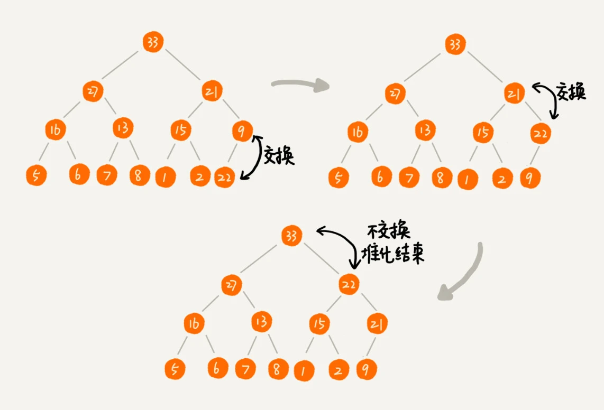
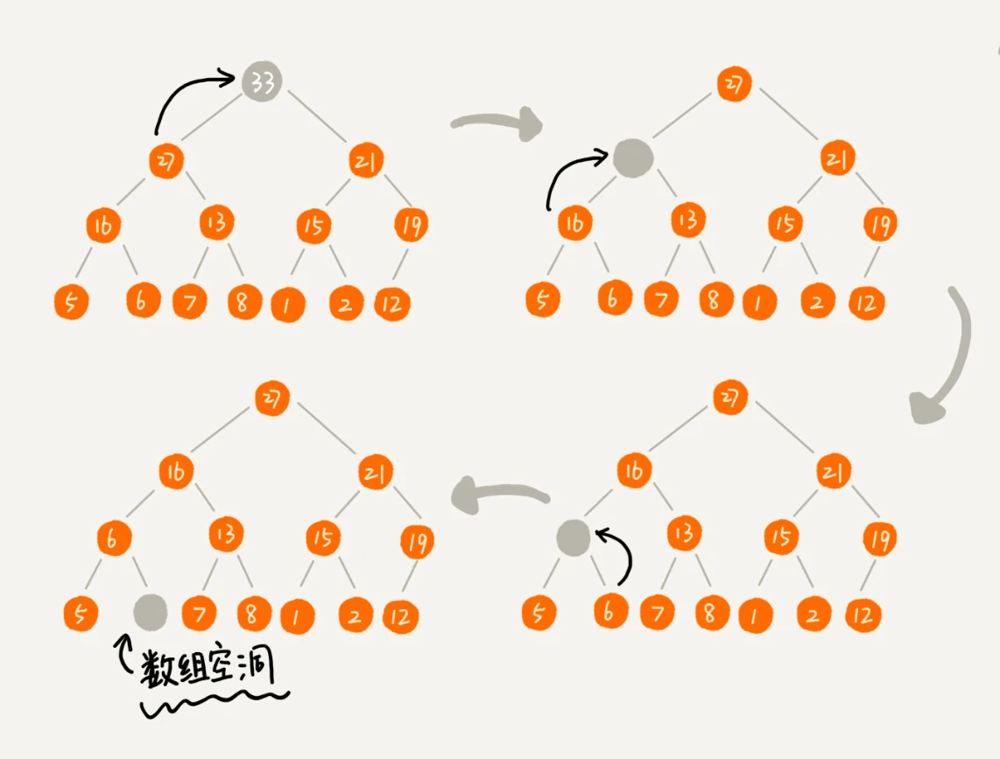
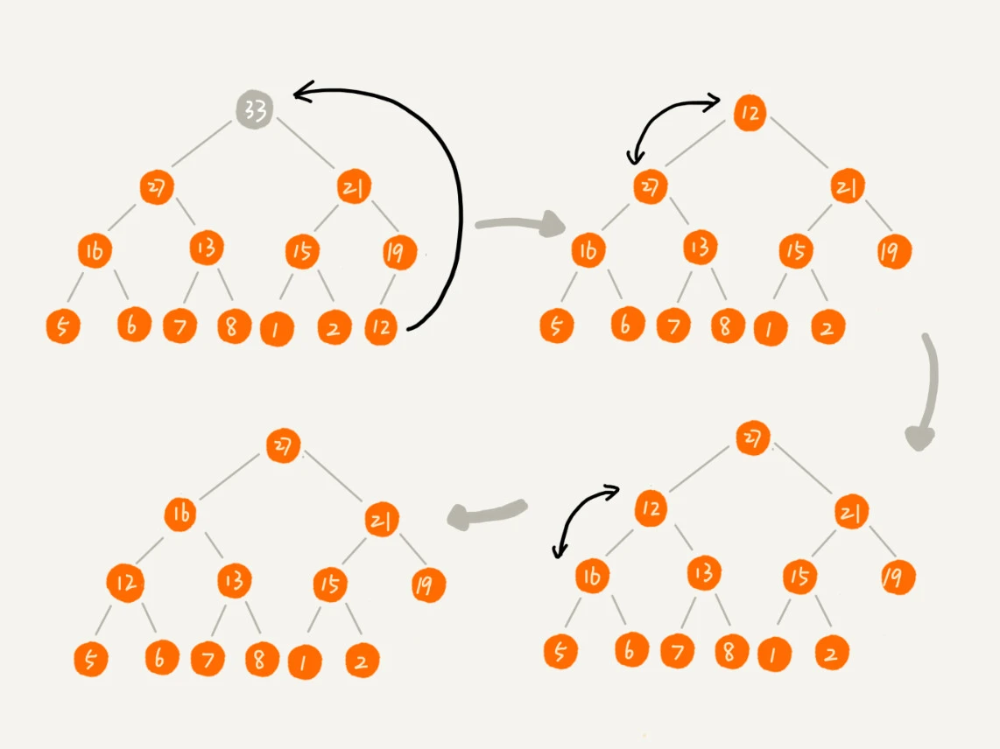

# 堆（Heap）

## 堆的定义

- 堆是一个[完全二叉树](../data_struct/binary_tree.md)。
- 堆中每一个节点的值都必须大于等于（或小于等于）其左右子节点的值。

### 大顶堆与小顶堆：

- 对于每个节点的值都**大于等于**子树中每个节点值的堆，是**大顶堆**。
- 对于每个节点的值都**小于等于**子树中每个节点值的堆，是**小顶堆**。

## 堆的实现

> 实现任何一个数据结构都需要考虑两个方面，**如何存储元素**以及对外公开的**操作接口**。

每次插入或删除操作，都需要通过调整元素位置来保证堆的特性。这个过程叫做**堆化**（heapify）。

### 如何存储

完全二叉树比较适合用 **数组** 来存储。用数组来存储完全二叉树是非常节省存储空间的。因为我们不需要存储左右子节点的指针，单纯地通过数组的下标，就可以找到一个节点的左右子节点和父节点。

如果根节点存储于下标为`0`的位置，下标为 `i` 的节点，父节点下标为 `(i-1)/2`，左子节点下标为 `2*i+1`，右子节点下标为 `2*i+2`。

```
父节点下标的证明

如果当前节点为其父节点的左子节点，父节点的下标 j，左子节点下标 i = 2*j+1，因此 j = (i-1)/2。 

如果当前节点为其父节点的右子节点，父节点的下标 j，右子节点下标 i = 2*j+2，因此 j = (i-2)/2，又因为右子节点坐标都是偶数，且计算机进行整数计算时结果取整，此时 (i-2)/2 的结果与 (i-1)/2 结果相同。因此 j = (i-1)/2 成立。

所以，下标为 i 的节点，父节点下标为 (i-1)/2。
```

### 插入元素



如图，需要对现有（大顶）堆中插入一个节点 `22`。会进行一个**向上堆化**的过程：

1. 新插入的节点与父节点对比大小。
2. 如果不满足子节点小于等于父节点的大小关系，就互换两个节点。
3. 一直重复这个过程，直到父子节点之间满足刚说的那种大小关系。

Go 语言 `container/heap` 包中添加元素的实现如下：

```go
// Push pushes the element x onto the heap.
// The complexity is O(log n) where n = h.Len().
func Push(h Interface, x any) {
	h.Push(x)
	up(h, h.Len()-1)
}

func up(h Interface, j int) {
	for {
		i := (j - 1) / 2 // parent
		if i == j || !h.Less(j, i) {
			break
		}
		h.Swap(i, j)
		j = i
	}
}
```

### 删除元素

直接移除堆顶元素，然后向下堆化，可能会造成最后堆化出来的堆并不满足完全二叉树的特性。



为了避免这种情况，把最后一个节点放到堆顶，然后利用同样的父子节点对比方法。对于不满足父子节点大小关系的，互换两个节点，并且重复进行这个过程，直到父子节点之间满足大小关系为止。这就是**向下堆化**方法。



因为我们移除的是数组中的最后一个元素，而在堆化的过程中，都是交换操作，不会出现数组中的“空洞”，所以这种方法堆化之后的结果，肯定满足完全二叉树的特性。

Go 语言 `container/heap` 包中删除元素的实现如下:

```go
// Pop removes and returns the minimum element (according to Less) from the heap.
// The complexity is O(log n) where n = h.Len().
// Pop is equivalent to Remove(h, 0).
func Pop(h Interface) any {
	n := h.Len() - 1
	h.Swap(0, n)
	down(h, 0, n)
	return h.Pop()
}

func down(h Interface, i0, n int) bool {
	i := i0
	for {
		j1 := 2*i + 1
		if j1 >= n || j1 < 0 { // j1 < 0 after int overflow
			break
		}
		j := j1 // left child
		if j2 := j1 + 1; j2 < n && h.Less(j2, j1) {
			j = j2 // = 2*i + 2  // right child
		}
		if !h.Less(j, i) {
			break
		}
		h.Swap(i, j)
		i = j
	}
	return i > i0
}
```

插入数据和删除堆顶元素的主要逻辑就是堆化，所以，往堆中插入一个元素和删除堆顶元素的时间复杂度都是 `O(logn)`。

## 真命题

对于使用数组存储的堆，且根节点存储在下标为0的位置，下列都是真命题。

1、 数组下标为 `i` 的节点

- **左子节点**下标：`2i + 1`
- **右子节点**下标：`2i + 2` 
- **父节点**下标：`(i-1)/2`

2、元素数量为 n 的堆，将根节点存在数组下标为0的位置，堆（完全二叉树）的最后一个非叶子节点下标为 `n/2 - 1`。

3、堆化过程中只需要保证**非叶子结点**所在槽位放入来正确的值即可，所以需要处理的下标范围为`[0:(n/2-1)]`。
