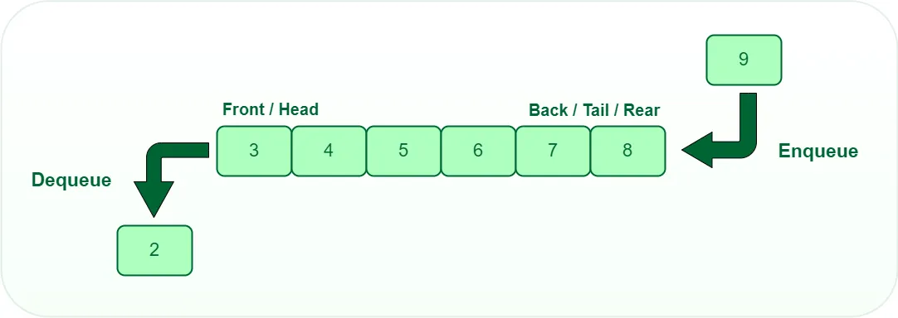

# 队列

## 队列的定义



队列是一种先进先出（**FIFO**, First-In-First-Out）的线性表。队列支持两个基本操作：
- **入队**（`enqueue`）：将数据单元放入队列尾部。
- **出队**（`dequeue`）：从队列头部取出数据单元。

队列的应用非常广泛，特别是一些具有高级特性的特殊队列，如 **循环队列**、**阻塞队列**、**并发队列**，它们在很多偏低层的系统、框架、中间件的开发中，起到关键性作用。

## 队列的实现

根据底层数据容器的数据结构的不同，可以分为**顺序队列**（基于数组实现）和**链式队列**（基于链表实现）。

### 操作接口

```go
type Q interface {
    Enqueue(any)
    Dequeue() any
    IsEmpty() bool
}
```

### 顺序队列

- 底层数据容器基于 go 的动态数组类型 slice。
- 为了保证线程安全，sync.RWMutex 以嵌入字段的方式组合进 Queue，因为这样调用的时候更舒服。建议：锁谁就放谁上面 ；）

```go
// Queue built by slice
type Queue struct {
    sync.RWMutex
    items      []any
}

// Enqueue an item to the rear of queue
func (q *Queue) Enqueue(item any) {
    q.Lock()
    defer q.Unlock()

    q.items = append(q.items, item)
}

// Dequeue an item from the front of queue
func (q *Queue) Dequeue() any {
    q.Lock()
    defer q.Unlock()

    if len(q.items) == 0 {
        return nil
    }

    ret := q.items[0]
    q.items = q.items[1:]

    return ret
}

// IsEmpty return the queue is empty or not
func (q *Queue) IsEmpty() bool {
    q.RLock()
    defer q.RUnlock()

    return len(q.items) == 0
}
```

### 链式队列

- 底层数据容器基于标准库 [container/list](https://pkg.go.dev/container/list) 实现。

```go
// Queue built by go std library list
type Queue struct {
    sync.RWMutex
    items *list.List
}

func NewQueue() *Queue {
    return &Queue{items: list.New()}
}

// Enqueue an item to the rear of queue
func (q *Queue) Enqueue(item any) {
    q.Lock()
    defer q.Unlock()
    _ = q.items.PushBack(item)
}

// Dequeue an item from the front of queue
func (q *Queue) Dequeue() any {
    q.Lock()
    defer q.Unlock()
    if e := q.items.Front(); e != nil {
        return q.items.Remove(e)
    }
    return nil
}

// IsEmpty return the queue is empty or not
func (q *Queue) IsEmpty() bool {
    q.RLock()
    defer q.RUnlock()
    return q.items.Len() == 0
}
```

## 参考资料

- [Queue, wikipedia.](https://en.wikipedia.org/wiki/Queue_(abstract_data_type))
- [Circular_buffer, wikipedia.](https://en.wikipedia.org/wiki/Circular_buffer)
- [Double-ended_queue, wikipedia.](https://en.wikipedia.org/wiki/Double-ended_queue)
- [Priority_queue, wikipedia.](https://en.wikipedia.org/wiki/Priority_queue)
