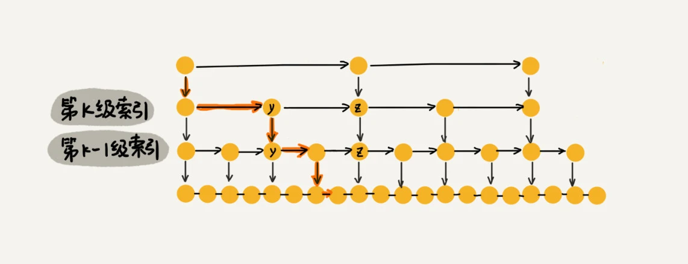
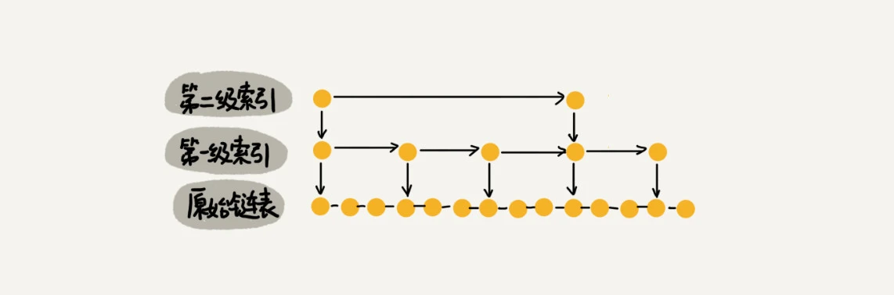
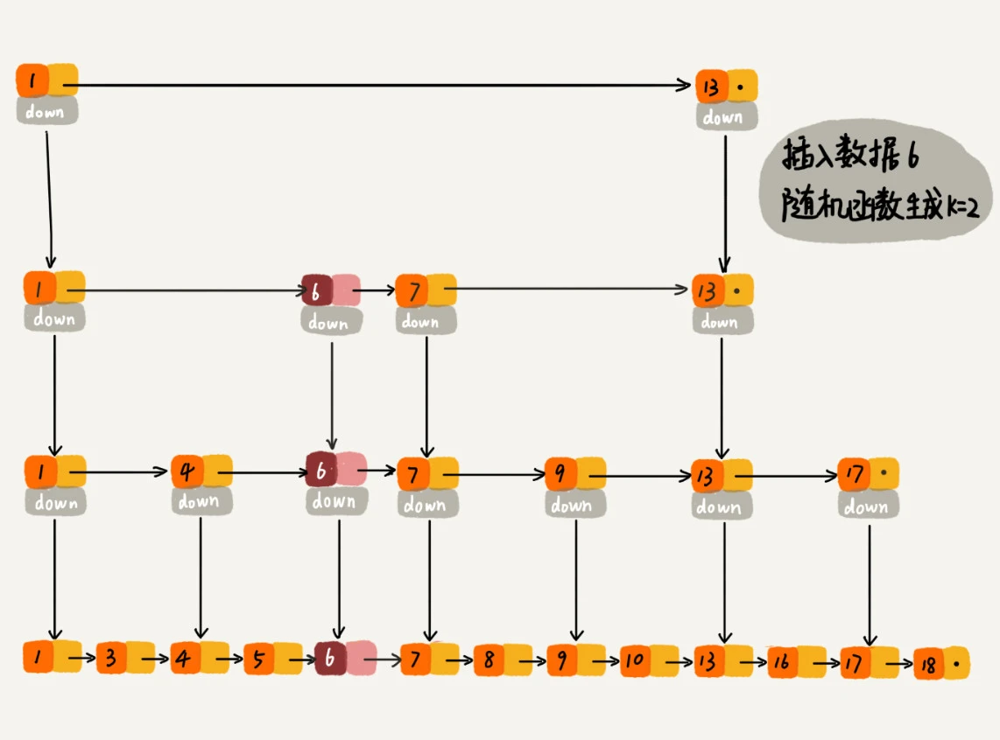

# 跳表（Skip list）

## 定义

**跳表是有序链表加多级索引的数据结构**。通过增加索引层，减少了查找一个节点所需遍历的结点个数，提高了查找效率。

## 时间复杂度 O(logn)

每两个结点会抽出一个结点作为上一级索引的结点，第 k 级索引的结点个数是第 k-1 级索引的结点个数的 1/2，那第 k 级索引结点的个数就是 n/(2^k)。

假设索引有 h 级，最高级的索引有 2 个结点。通过上面的公式，我们可以得到 n/(2^h) = 2，从而求得 h = log2n - 1。如果包含原始链表这一层，整个跳表的高度就是 log2n。我们在跳表中查询某个数据的时候，如果每一层都要遍历 m 个结点，那在跳表中**查询一个数据**的时间复杂度就是 `O(m*logn)`。

前面这种索引结构，我们每一级索引都最多只需要遍历 3 个结点，也就是说 m=3 所以在跳表中查询任意数据的时间复杂度就是 `O(logn)`。

多么优美的设计！通过添加索引，将普通链表查询效率提升至与二分查找一致。

## 空间复杂度 O(n)

假设原始链表大小为 n，那第一级索引大约有 n/2 个结点，第二级索引大约有 n/4 个结点，以此类推，每上升一级就减少一半，直到剩下 2 个结点。

几层索引的结点总和就是 n/2 + n/4 + n/8 + … + 8 + 4 + 2 = `n-2`。跳表的空间复杂度是 `O(n)`。

通过将索引结点间隔变大，每3个结点抽取一个，索引结点的总数变为 n/3 + n/9 + n/27 + ... + 9 + 3 + 1 = `n/2`。尽管空间复杂度还是 `O(n)`，但比上面的每两个结点抽一个结点的索引构建方法，要减少了一半的索引结点存储空间。

## 插入数据

对于纯粹的单链表，需要遍历每个结点，来找到插入的位置。对于跳表来说，查找某个结点的时间复杂度是 O(logn)，所以查找某个数据应该插入的位置，方法也是类似的，时间复杂度也是 `O(logn)`。

当我们不停地往跳表中插入数据时，如果我们不更新索引，就有可能出现某两个索引结点之间数据非常多的情况。极端情况下，跳表还会退化成单链表。

作为一种 **动态数据结构**，我们需要某种手段来维护索引与原始链表大小之间的平衡，也就是说，如果链表中结点多了，索引结点就相应地增加一些，避免复杂度退化，以及查找、插入、删除操作性能下降。跳表是通过 **随机函数** 来维护前面提到的“平衡性”。

通过一个随机函数，来决定将这个结点插入到哪几级索引中，比如随机函数生成了值 K，那我们就将这个结点添加到第一级到第 K 级这 K 级索引中。

## 删除数据

如果这个结点在索引中也有出现，我们除了要删除原始链表中的结点，还要 **删除索引中的**。因为单链表中的删除操作需要拿到要删除结点的 **前驱结点**，然后通过指针操作完成删除。所以在查找要删除的结点的时候，一定要获取前驱结点。当然，如果我们用的是双向链表，就不需要考虑这个问题了。