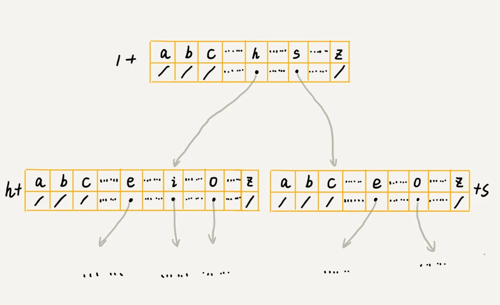

# Trie 树

## 定义


Trie 树，也叫“字典树”。它是一种专门处理字符串匹配的数据结构，用来解决在一组字符串集合中快速查找某个字符串的问题。

**Trie 树的本质，就是利用字符串之间的公共前缀，将重复的前缀合并在一起**。

## 实现

### 如何存储



假设字符串中只有从 a 到 z 这 26 个小写字母，我们在数组中下标为 0 的位置，存储指向子节点 a 的指针，下标为 1 的位置存储指向子节点 b 的指针，以此类推，下标为 25 的位置，存储的是指向的子节点 z 的指针。如果某个字符的子节点不存在，我们就在对应的下标的位置存储 nil。

在 Trie 树中查找字符串的时候，可以通过字符的 ASCII 码减去“a”的 ASCII 码，迅速找到匹配的子节点的指针。比如，d 的 ASCII 码减去 a 的 ASCII 码就是 3，那子节点 d 的指针就存储在数组中下标为 3 的位置中。

```go
// Node 表示每个字符节点。
type Node struct {
   // 当前节点存储的字符。a,b,c......z。
   Char string
   // 当前节点的子节点数组，存储 a-z 26个字符。
   Children [26]*Node
}

// NewNode 初始化一个节点，它的26个子节点都是 nil。
func NewNode(char string) *Node {
   node := &Node{Char: char}
   for i := 0; i < 26; i++ {
      node.Children[i] = nil
   }
   return node
}

```
### 创建 Trie 树

```go
type Trie struct {
    RootNode *Node
}

func NewTrie() *Trie {
    // Trie 树根节点无用，初始化成空字符。
    root := NewNode("\000")
    return &Trie{RootNode: root}
}
```

### 插入元素

```go
// Insert 插入一个单词（字符串）
func (t *Trie) Insert(word string) error {
    current := t.RootNode
    // 去除空格并转成小写
    strippedWord := strings.ToLower(strings.ReplaceAll(word, " ", ""))
    for i := 0; i < len(strippedWord); i++ {
        index := strippedWord[i] - 'a'
        // 检查节点是否为存在，不存在则初始化节点。
        if current.Children[index] == nil {
            current.Children[index] = NewNode(string(strippedWord[i]))
        }
        current = current.Children[index]
    }
    return nil
}
```

### 查找元素

```go
// SearchWord 会返回这个单词是否存在于这个树中
func (t *Trie) SearchWord(word string) bool {
    strippedWord := strings.ToLower(strings.ReplaceAll(word, " ", ""))
    current := t.RootNode
    for i := 0; i < len(strippedWord); i++ {
        index := strippedWord[i] - 'a'
        if current == nil || current.Children[index] == nil {
            return false
        }
    }
    return true
}
```

## 性能

### 时间复杂度
  
插入时间复杂度：O(n)，n 表示所有字符串的长度和。构建 Trie 树的过程，需要扫描所有的字符串。

查找时间复杂度：O(k)，k 表示要查找的字符串的长度。

空间占用方面，每个节点不论子节点有几个，都需要一个长度为26的数组存储，每个元素至少需要一个 8 字节的指针。当然，也有 Trie 树的变体结构来解决空间占用问题。比如 Gin 框架中路由组件用到的 Radix Tree。

## 参考资料

- [Trie 树，数据结构与算法之美](https://time.geekbang.org/column/article/72414)
- [Radix Tree 与 Gin 实现](https://wingsxdu.com/posts/data-structure/radix-tree/)