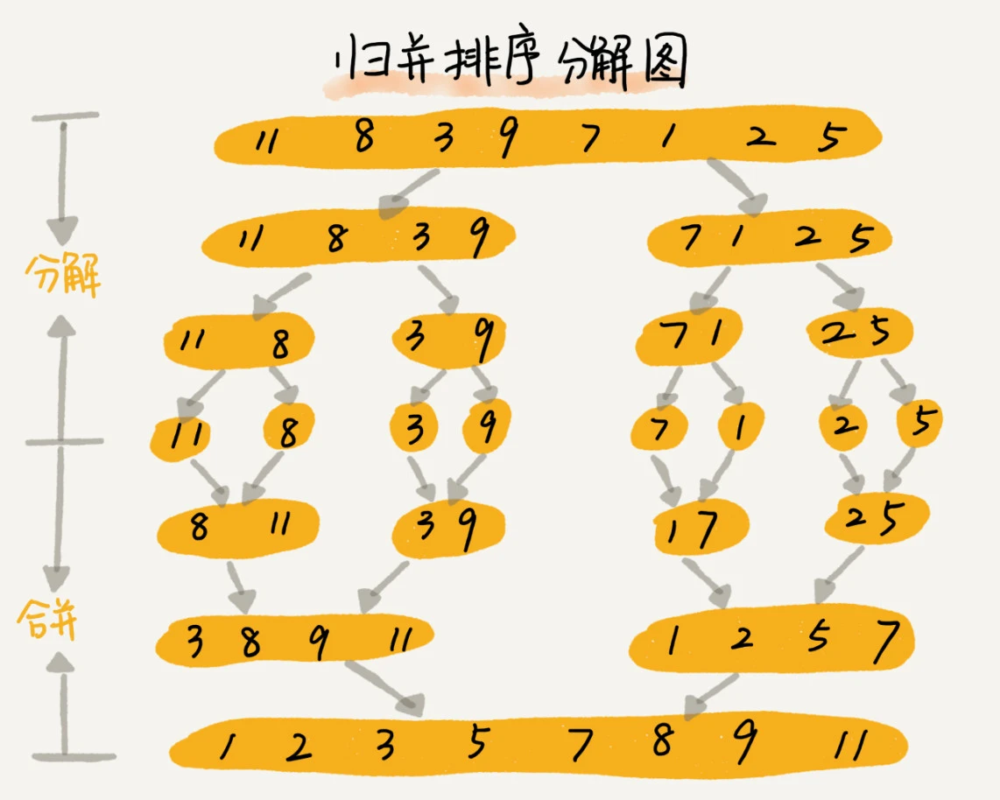

# 归并排序（Merge Sort）

## 核心思想

如果要排序一个数组，我们先把数组从中间**分成前后两部分**，然后对前后两部分**分别排序**，再将排好序的两部分**合并**在一起，这样整个数组就都有序了。



归并排序使用的就是**分治思想**。分治，顾名思义，就是分而治之，将一个大问题分解成小的子问题来解决。小的子问题解决了，大问题也就解决了。

分治算法一般都是用**递归**来实现的。分治是一种解决问题的处理思想，递归是一种编程技巧，这两者并不冲突。
```
递推公式：
merge_sort(p…r) = merge(merge_sort(p…q), merge_sort(q+1…r))

终止条件：
p >= r 不用再继续分解
```

## 性能评估

- 最坏时间复杂度：`O(n*log(n))`
- 最好时间复杂度：`O(n*log(n))`
- 平均时间复杂度：`O(n*log(n))`
- 空间复杂度：`O(n)`
- 稳定性：`稳定`

## 代码实现

```go 
func MergeSort(items []int) []int {
    if len(items) < 2 {
        return items
    }
    first := MergeSort(items[:len(items)/2])
    second := MergeSort(items[len(items)/2:])
    return merge(first, second)
}

func merge(a []int, b []int) []int {
    final := []int{}
    i := 0
    j := 0
    for i < len(a) && j < len(b) {
        if a[i] < b[j] {
            final = append(final, a[i])
            i++
        } else {
            final = append(final, b[j])
            j++
        }
    }
    for ; i < len(a); i++ {
        final = append(final, a[i])
    }
    for ; j < len(b); j++ {
        final = append(final, b[j])
    }
    return final
}
```

## 参考资料

- [https://blog.boot.dev/golang/merge-sort-golang/](https://blog.boot.dev/golang/merge-sort-golang/) 
- [https://time.geekbang.org/column/article/41913](https://time.geekbang.org/column/article/41913)