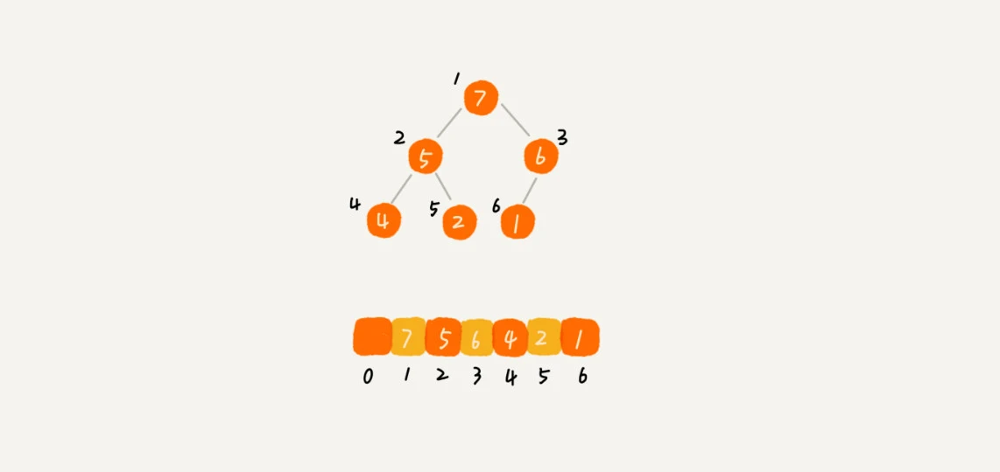
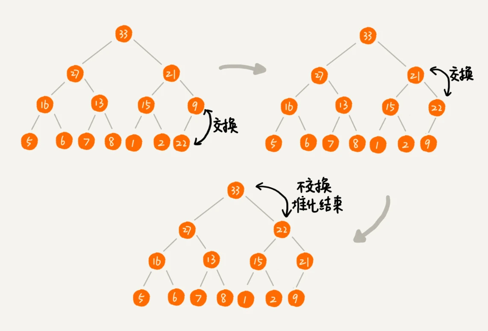

# 堆（Heap）

## 堆的定义

- 堆是一个完全二叉树。
- 堆中每一个节点的值都必须大于等于（或小于等于）其左右子节点的值。

(完全二叉树要求，除了最后一层，其他层的节点个数都是满的，最后一层的节点都靠左排列。)--->link to tree.md

### 大顶堆与小顶堆

- 对于每个节点的值都**大于等于**子树中每个节点值的堆，是大顶堆。
- 对于每个节点的值都**小于等于**子树中每个节点值的堆，是小顶堆。

## 堆的实现

实现一个数据结构需要考虑两个方面，**如何存储元素** 以及对外提供的 **操作接口**。

每次操作，都需要通过调整元素位置来保证堆的特性。这个过程叫做**堆化**（heapify）。

### 如何存储

完全二叉树比较适合用 **数组** 来存储。用数组来存储完全二叉树是非常节省存储空间的。因为我们 **不需要存储左右子节点的指针**，单纯地通过数组的下标，就可以找到一个节点的左右子节点和父节点。

数组中下标为 i 的节点的左子节点，就是下标为 i∗2 的节点，右子节点就是下标为 i∗2+1 的节点，父节点就是下标为 2i​ 的节点。

### 插入元素

如图，需要对现有堆中插入一个节点 `22`。过程如下：

- 新插入的节点与父节点对比大小。
- 如果不满足子节点小于等于父节点的大小关系，就互换两个节点。
- 一直重复这个过程，直到父子节点之间满足刚说的那种大小关系。

### 删除元素

## 真命题

对于存储于数组中的堆来说，下列都是真命题。

1、 数组下标为 `n` 的节点

- **左子节点**下标：`2n + 1`
- **右子节点**下标：`2n + 2` 
- **父节点**下标：`n/2 - 1`

2、数组的最后一个元素，是堆（完全二叉树）的最后一层**叶子节点**，且是它父节点的**左子节点**。

3、堆化过程中只需要保证**非叶子结点**所在槽位放上了正确的值即可，所以需要处理的下标范围为`[0:(n/2-1)]`。