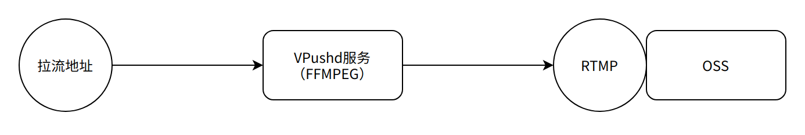

# 直播视频流存储方案

## 需求：
根据直播媒体对外公开的视频流拉流地址，对某场直播的视频数据进行存储。
存储下的视频可以根据（开始时刻，结束时刻）对任意时间区间进行提取播放。
同一场直播数据，多次提取不能造成存储容量的上升。

## 方案：

### VPushd 服务

1. VPushd 服务是对 ffmpeg 进程的包装。
2. 借助 ffmpeg 的能力从拉流地址拉取视频流，并遵循 RTMP 协议向推流地址推送视频流。
3. VPushd 服务可分解成 `Control Node` 和 `Worker Node`，前者负责任务状态管理和任务队列分发，后者作为无状态节点，单纯的执行【拉流-格式转换-推流】任务。如此，可以对 worker 节点任意扩缩，以实现服务的高可用。

### OSS 服务

1. OSS 支持 RTMP 推流作为数据输入方式，为了便于操作在此之上有一层封装（liveChannel）。
2. 对视频的存储格式为 M3U8 视频文件，可以生成任意时间区间的 playlist 索引文件，对同一份视频切片文件随意提取。
3. 可以根据视频索引文件生成对外公开的视频访问地址。

## References

- [阿里云OSS LiveChannel](https://www.alibabacloud.com/help/zh/object-storage-service/latest/livechannel-related-operations-overview)
