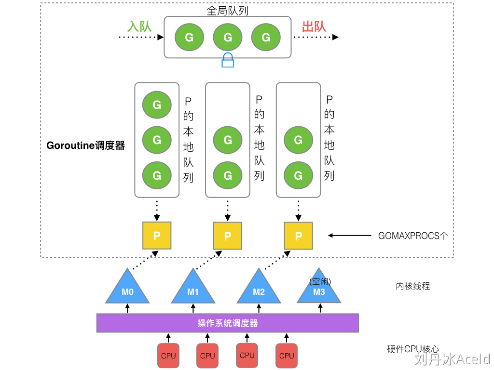
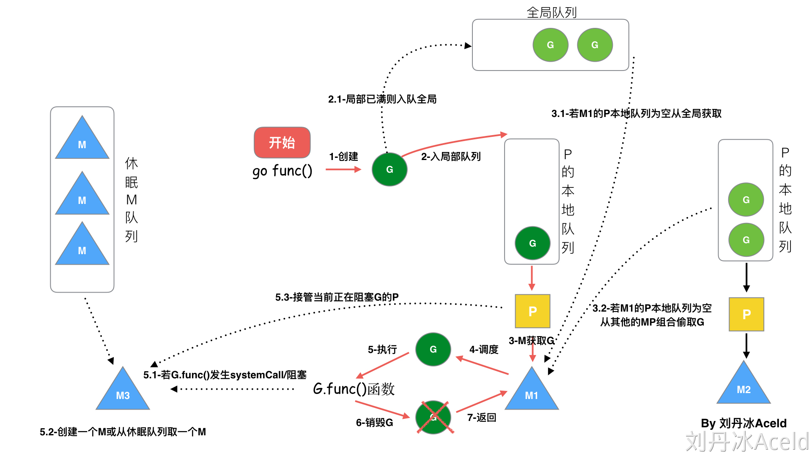

# Goroutine 调度模型

## 模型结构

- G（[Goroutine](https://cs.opensource.google/go/go/+/refs/tags/go1.20:src/runtime/runtime2.go;l=407)）
- P（[Processor](https://cs.opensource.google/go/go/+/refs/tags/go1.20:src/runtime/runtime2.go;l=609)）
- M（[Machine Thread](https://cs.opensource.google/go/go/+/refs/tags/go1.20:src/runtime/runtime2.go;l=526)）

## M0 与 G0

> 起初，上帝创造天地。地是空虚混沌，渊面黑暗；神的灵运行在水面上。上帝说：“要有光。”就有了光。

- 一个 Go 进程运行后会先创建 M0 线程，它的目的是用来创建 main 函数所属 G -- G0 。完成任务后 M0 与其他 M 无异。
- M0 创建的 G0，是一个全局变量。
- 每个 M 都会创建一个自己的 G0。
- G0 用来调度 G，调度过程中用到了 G0 的栈空间。

## 调度器的生命周期

## Goroutine 调度流程

1. 任意 G 通过 `go func()` 创建 goroutine，优先放入 G 所在 P 的本地队列中。如果本地队列已满，需要执行负载均衡(把 P 中本地队列中前一半的 G，还有新创建 G 转移到全局队列)。
2. G 只能运行在 M 中，一个 M 必须持有一个 P，M 与 P 是 1：1 的关系。获取 G 的策略看下面**调度策略**。
3. M 调度 G 执行的过程是一个循环机制，看下面**调度循环**。
4. 当 M 执行某一个 G 时候如果发生了syscall或则其余阻塞操作，M 会阻塞，如果当前有一些 G 在执行，runtime 会把这个线程 M 从 P 中摘除(detach)，然后再创建一个新的 M(如果有空闲的线程可用就复用空闲线程)来服务于这个 P。
5. 当 M 阻塞结束，这个 G 会尝试获取一个空闲的 P 执行，优先放入到这个 P 的本地队列。如果获取不到 P（被别的 M 绑定），那么这个线程 M 变成休眠状态，加入到空闲线程中，然后这个 G 会被放入全局队列中。

## 调度策略

P 在执行调度时，会按照以下优先级与顺序进行：

1. 先尝试从 runnext 中获取下一个可执行的 G，如果 runnext 为空，则继续从当前 P 的本地运行队列 runq 中获取需要执行的 G。
2. 如果本地运行队列为空，则尝试从全局队列中获取需要执行的 G。
3. 如果全局队列为空，则尝试从其他 P 的本地队列中窃取 G。
4. 如果窃取不到，当前 P 与 M 解绑，P 被放入空闲队列中，M 进入休眠状态。

[schedule, src/runtime/proc.go](https://cs.opensource.google/go/go/+/refs/tags/go1.20:src/runtime/proc.go;l=3318-3388;drc=ffb07d0c66db2f3f33faedf2927f9aa476d47720)

### 1. 从本地队列获取

如果 runnext 不为空则返回对应的 G，如果为空则继续从 P 的本地运行队列 runq 中获取需要执行的 G。因为可能存在其他 P 窃取任务造成的同时访问情况，所以这里的获取操作都需要**加锁**。

[runqget, src/runtime/proc.go](https://cs.opensource.google/go/go/+/refs/tags/go1.20:src/runtime/proc.go;l=6070-6095;bpv=0;bpt=0)

### 2. 从全局队列获取

当 P 每执行61次调度，或者本地队列中不存在可用的 G 时，从全局队列获取一批 G 到本地队列中。

全局队列的数据结构是一个双端队列。由于多个 P 共享 全局队列，先根据 P 的数量平分全局队列中的 G，同时要转移数量不能超过本地队列容量一半（256/2=128），再通过循环调用 runqput 将全局队列中的 G 放入 P 的本地队列中。如果 P 的本地队列已满，调度器会将本地队列中的一半 G 放入全局队列。

[globrunqget, src/runtime/proc.go](https://cs.opensource.google/go/go/+/refs/tags/go1.20:src/runtime/proc.go;l=5753-5782;bpv=1;bpt=1)

### 3. 获取准备就绪的网络协程

窃取前的一个小优化，在本地队列和全局队列都找不到可用 G 的情况下，调度器会寻找当前是否有已经准备好的网络协程。runtime.netpoll 获取当前可运行的协程列表。返回第一个 G，并通过 injectglist 将其余 G 放入全局队列。

[2740-2757, src/runtime/proc.go](https://cs.opensource.google/go/go/+/refs/tags/go1.20:src/runtime/proc.go;l=2740-2757;drc=ffb07d0c66db2f3f33faedf2927f9aa476d47720;bpv=0;bpt=1)

### 4. 从其他 P 本地队列窃取

自旋PM（前三部分都未获得可用 G），需要从其他 P 的本地队列中窃取可用的 G。

1）先选 P

[allp []*p](https://cs.opensource.google/go/go/+/refs/tags/go1.20:src/runtime/runtime2.go;l=1150;bpv=0;bpt=1) 这个全局变量存储着所有的 P。为了保证公平性，Go 语言采用[一种方式](https://cs.opensource.google/go/go/+/refs/tags/go1.20:src/runtime/proc.go;l=3043-3047;bpv=0;bpt=1)既保证了随机性又保证了每个 P 都能被遍历一次。

2）再偷 G

找到窃取目标 P1 后，会将 P1 本地队列中的一半 G 放入自己的本地队列中。具体通过 [runqgrab](https://cs.opensource.google/go/go/+/refs/tags/go1.20:src/runtime/proc.go;l=6136-6190;bpv=0;bpt=1) 实现。

## 调度循环

g0 -> G -> g0 为一轮调度循环，它与一次上下文切换类似，但是上下文切换关注的是具体的状态，而调度循环关注的是调度流程。

### g0 -> G 

1. [schedule](https://cs.opensource.google/go/go/+/refs/tags/go1.20:src/runtime/proc.go;l=3318-3388;drc=ffb07d0c66db2f3f33faedf2927f9aa476d47720) 函数处理具体的调度策略，选择下一个要执行的 G。
2. [execute](https://cs.opensource.google/go/go/+/refs/tags/go1.20:src/runtime/proc.go;l=2619-2666) 函数执行一些状态转移、G 与 M 之间的绑定等操作。
3. [gogo]() 函数与操作系统有关，用于完成栈的切换及 CPU 寄存器的恢复。

### G -> g0

1. mcall 函数用于保存当前 G 的执行现场，并切换到 g0。
2. 切换到 g0 后会根据不同的切换原因执行不同的函数
    - 主动让权：gosched_m
    - 协程退出：goexit, 并将 G 让入 P 的 freeg 队列
    - ...
3. schedule 重新调度

## 调度时机

### 1. 主动调度

用户在代码中执行 [runtime.Gosched](https://cs.opensource.google/go/go/+/refs/tags/go1.20:src/runtime/proc.go;l=3503-3516;drc=ffb07d0c66db2f3f33faedf2927f9aa476d47720) 函数。

1. 从当前 G 切换到 g0
2. 取消 G 与 M 的绑定关系
3. 将 G 放入全局队列
4. 重新调度（调用 schedlue 函数）

### 2. 被动调度

G 在休眠、channel 阻塞、网络 I/O 阻塞、执行垃圾回收而暂停时，被动让渡自己的执行权。[gopark](https://cs.opensource.google/go/go/+/refs/tags/go1.20:src/runtime/proc.go;l=347-382)

1. 从当前 G 切换到 g0
2. 取消 G 与 M 的绑定关系
3. 重新调度（调用 schedlue 函数）
4. 如果当前 G 需要被唤醒，添加到当前 P 本地队列中。

### 3. 抢占调度

...

## 参考资料

- [简介G-P-M调度模型](https://mp.weixin.qq.com/s/1CY3E5daJ5U42orVwzCpaw)
- [调度场景过程全解析](https://www.yuque.com/aceld/golang/srxd6d#5c3da99e)

