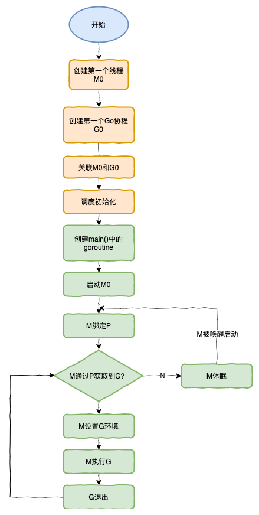

# Goroutine 调度模型

## 模型结构


- G（[Goroutine](https://cs.opensource.google/go/go/+/refs/tags/go1.20:src/runtime/runtime2.go;l=407)）
- P（[Processor](https://cs.opensource.google/go/go/+/refs/tags/go1.20:src/runtime/runtime2.go;l=609)）
- M（[Machine Thread](https://cs.opensource.google/go/go/+/refs/tags/go1.20:src/runtime/runtime2.go;l=526)）

## 调度器的生命周期



## Go 世界的开始

runtime.rt0_go() 中步骤如下

### 1. 

初始化 g0 的栈区间，检测 CPU 厂商及型号，按需调用 _cgo_init()，设置和检测 TLS，将 m0 和 g0 互相关联，并将 g0 设置到 TLS 中。

### 2. runtime.args() ...
### 3. runtime.osinit() ...

### 4. [runtime.schedinit()](https://cs.opensource.google/go/go/+/refs/tags/go1.20:src/runtime/proc.go;l=669-775;bpv=0;bpt=1)

P 已经初始化完毕，还没有创建任何 G，所有 P 的 runq 都是空的。procresize() 函数返回后当前线程回和第一个 P 关联，也就是 allp[0]。

### 5. [runtime.newproc()](https://cs.opensource.google/go/go/+/refs/tags/go1.20:src/runtime/proc.go;l=4238-4254;bpv=1;bpt=1)

创建主 goroutine，指定入口函数 runtime.main()，并把它放入 P 的本地队列中。

此时 GMP 模型结构如下：
```
G(g0)-M(m0)-P(allp[0])  ... P(allp[n]) ... P(allp[GOMAXPROCS-1])
            |
            runq[ G(main goroutine) ]
```

### 6. [runtime.mstart()](https://cs.opensource.google/go/go/+/refs/tags/go1.20:src/runtime/proc.go;l=1416-1465;bpv=0;bpt=1)

当前线程进入调度循环。一般情况下线程进入调度循环后不会再返回。进入调度循环的线程会去执行上一步创建的 goroutine。

主 goroutine 得到执行后，runtime.main() 会设置最大栈大小、启动监控线程 sysmon、初始化 runtime 包、开启 GC、最后初始化 mian 包并调用 main.main() 函数。

至此，初始化过程完毕。

## 调度循环

以 go 1.20 代码为例分析 [runtime.schedule()](https://cs.opensource.google/go/go/+/refs/tags/go1.20:src/runtime/proc.go;l=3318-3388;drc=b35ee3b0467e042621aec9af7f18a2d8c63029ad)。

```go
// One round of scheduler: find a runnable goroutine and execute it.
// Never returns.
func schedule() {
    // 获取当前正在运行的 G，执行 schedule() 函数时一般都是系统栈 g0。
    // mp 为当前线程 M
    mp := getg().m

    // 当前 M 持有锁不进行调度
    if mp.locks != 0 {
        throw("schedule: holding locks")
    }

    // 当前 M 有没有和 G 绑定，如果有，这个 M 不能用来执行其他 G 了，只能挂起等待与之绑定的 G 得到调度。
    if mp.lockedg != 0 {
        stoplockedm()
        execute(mp.lockedg.ptr(), false) // Never returns.
    }

    // 当前 M 正在执行 cgo 函数调用，不能被调用。
    // 因为 cgo 函数调用占用 g0 栈空间
    if mp.incgo {
        throw("schedule: in cgo")
    }

top:
    // 获取当前 P
    pp := mp.p.ptr()
    // 标记字段，禁止对 P 的抢占
    pp.preempt = false


    // 安全检查，如果 MP 自旋状态，runnext 与 本地队列必须为空 
    // Check this before calling checkTimers, as that might call
    // goready to put a ready goroutine on the local run queue.
    if mp.spinning && (pp.runnext != 0 || pp.runqhead != pp.runqtail) {
        throw("schedule: spinning with local work")
    }

    // 找到可执行的 G
    gp, inheritTime, tryWakeP := findRunnable() // blocks until work is available

    // 当前 M 即将执行 G，如果此时时自旋状态，需要修改状态。可能会创建一个新的自旋 M
    if mp.spinning {
        resetspinning()
    }

    // 判断是否处于禁止调度用户协程的状态
    // 如果是系统协程，可以执行
    // 否则，需要暂存到 disable 队列中，调度逻辑跳转到 top 重新寻找可执行的 G
    if sched.disable.user && !schedEnabled(gp) {
        // Scheduling of this goroutine is disabled. Put it on
        // the list of pending runnable goroutines for when we
        // re-enable user scheduling and look again.
        lock(&sched.lock)
        if schedEnabled(gp) {
            // Something re-enabled scheduling while we
            // were acquiring the lock.
            unlock(&sched.lock)
        } else {
            sched.disable.runnable.pushBack(gp)
            sched.disable.n++
            unlock(&sched.lock)
            goto top
        }
    }

    // 尝试唤醒新的线程，以保证有足够的线程来调度 GCworker 和 tracereader
    if tryWakeP {
        wakep()
    }
    // 判断 G 是否有绑定的 M，如果有就唤醒 M 来执行 gp
    if gp.lockedm != 0 {
        // Hands off own p to the locked m,
        // then blocks waiting for a new p.
        startlockedm(gp)
        goto top
    }

    // 如果 G 没有绑定 M 通过这个函数来执行。
    // 关联 gp 与 当前 M
    // 将 gp 状态设置为 _Grunning
    // 通过 gogo() 恢复上下文
    execute(gp, inheritTime)
}
```


## 参考资料

- [简介G-P-M调度模型](https://mp.weixin.qq.com/s/1CY3E5daJ5U42orVwzCpaw)
- [深入golang runtime的调度](https://zboya.github.io/post/go_scheduler/#%E6%B7%B1%E5%85%A5golang-runtime%E7%9A%84%E8%B0%83%E5%BA%A6)
- [调度场景过程全解析](https://www.yuque.com/aceld/golang/srxd6d#5c3da99e)


