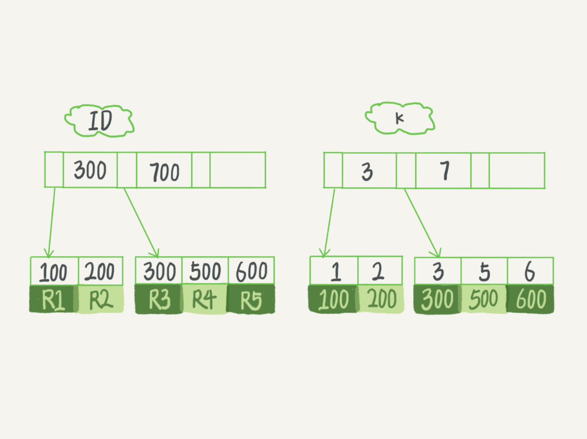

# 索引

索引的出现其实就是为了提高数据查询的效率，就像书的目录一样。使用任何一款数据库系统都应该首先掌握它的存储模型。所谓存储模型一般指的是索引模型。

## 常见索引模型

既然索引的使命就是提高数据查询效率，模型选择时需要考虑以下几个方面：

- 从需求出发，即从需要提供的 API 出发。
  - 等值查询
  - 范围查询
  - 插入
  - 更新
- 读写性能，每个 API 的性能如何。
- 存储介质。
  - 内存
  - 外部存储

### [1.哈希表](../../000-数据结构与算法/data_struct/hash_table.md)

- 优点：天生 KV 特性 `O(1)`，等值查询性能强。
- 缺点：存储的无序性，导致范围查询需要扫描全表。

### [2.有序数组](../../000-数据结构与算法/data_struct/array.md)

- 优点：可以使用二分查找算法 `O(log N)`，等值查询和范围查询性能都很强。
- 缺点：更新和插入动作需要进行元素搬移，写入性能差。

### [3.二叉搜索树](../../000-数据结构与算法/data_struct/binary_search_tree.md)

- 优点：读写性能都强 `O(log N)`。
- 缺点：索引不止存在内存中，还要写到磁盘上。存储大量数据，树的高度太高了（100万节点，树高20）。磁盘访问次数变大。

## InnoDB 引擎的索引模型

MySQL 的索引时存储引擎层面实现的，拿 InnoDB 来说，它选择使用 B+ 树来作为索引模型。



根据叶子节点的内容，索引类型分为**主键索引**和**非主键索引**。

- 主键索引的叶子节点存的是整行数据。在 InnoDB 里，主键索引也被称为**聚簇索引**（clustered index）。
- 非主键索引的叶子节点内容是主键的值。在 InnoDB 里，非主键索引也被称为**二级索引**（secondary index）。

### 索引的维护

磁盘中对叶子节点的存储是以页为单位的，这必然涉及一个问题，如果一个数据页已满，例如 [R3 R4 R5] 数据页，此时在 R4 和 R5 之间插入一条新数据，就会发生**页分裂**。有分裂就有合并。当相邻两个页由于删除了数据，利用率很低之后，会将数据页做**合并**。合并的过程，可以认为是分裂过程的逆过程。

那么为了解决上述问题导致的数据空洞，是否可以通过 `alter table T engine=InnoDB` 语句重建索引来解决。

## 索引使用最佳实现

所有的最佳实践都是在充分利用索引模型的基础上总结出来的。

### 覆盖索引

现有基础数据如下：
```sql
mysql> create table T (
ID int primary key,
k int NOT NULL DEFAULT 0, 
s varchar(16) NOT NULL DEFAULT '',
index k(k))
engine=InnoDB;

insert into T values(100,1, 'aa'),(200,2,'bb'),(300,3,'cc'),(500,5,'ee'),(600,6,'ff'),(700,7,'gg');
```


如果执行 ```select * from T where k between 3 and 5``` 语句，执行流程如下：

1. 在 k 索引树上找到 k=3 的记录，取得 ID = 300；
2. 再到 ID 索引树查到 ID=300 对应的 R3；
3. 在 k 索引树取下一个值 k=5，取得 ID=500；
4. 再回到 ID 索引树查到 ID=500 对应的 R4；
5. 在 k 索引树取下一个值 k=6，不满足条件，循环结束。
   
其中回到主键索引树上查数据的过程，叫**回表**。

如果执行 ```select ID from T where k between 3 and 5``` 语句，因为二级索引 k 的叶子结点上刚好存储了主键 ID，所以只扫描 k 这颗二级索引树即可，无需回表。这中情况就是**覆盖索引**。

### 最左前缀原则

**B+ 树这种索引结构，数据扫描遵循最左前缀原则**。


如图联合索引 (name, age)

- 当你的逻辑需求是查到所有名字是“张三”的人时，可以快速定位到 ID4，然后向后遍历得到所有需要的结果。
- 如果你要查的是所有名字第一个字是“张”的人，你的 SQL 语句的条件是"where name like ‘张 %’"。这时，你也能够用上这个索引，查找到第一个符合条件的记录是 ID3，然后向后遍历，直到不满足条件为止。
 
可以看到，不只是索引的全部定义，只要满足最左前缀，就可以利用索引来加速检索。这个最左前缀可以是联合索引的最左 N 个字段，也可以是字符串索引的最左 M 个字符。

### 索引下推

还是这个联合索引的例子，如果你执行下面的语句，是什么执行逻辑呢？

```
mysql> select * from tuser where name like '张%' and age=10 and ismale=1;
```


在 MySQL5.6 之前，只能从 ID3 开始一个个回表。到主键索引上找出数据行，再对比字段值。


而 MySQL5.6 引入的**索引下推**优化（index condition pushdown)，可以在索引遍历过程中，对索引中包含的字段先做判断，直接过滤掉不满足条件的记录，减少回表次数。