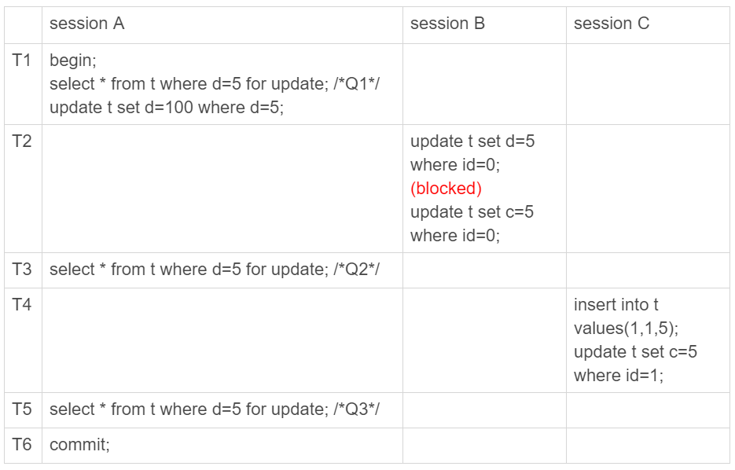

# 隔离级别与加锁机制

## 1 事务的隔离性（Isolation）

### 1.1 多个事务同时执行的问题

- **脏读（dirty read）：** 指一个事务中访问到了另外一个事务未提交的数据。
- **不可重复读（non-repeatable read）：** 一个事务读取同一条记录2次，得到的结果不一致。
- **幻读（phantom read）：** 一个事务读取2次，得到的记录条数不一致。

### 1.2 隔离级别

    SQL 标准提供了四种事务隔离级别，不同数据库有不同实现。隔离级别越严，效率越低。
    MySQL 默认可重复读。

- **读未提交（read uncommitted）：** 一个事务还没提交时，它做的变更就能被别的事务看到。
- **读提交（read committed）：** 一个事务提交之后，它做的变更才会被其他事务看到。
- **可重复读（repeatable read）：** 一个事务执行过程中看到的数据，总是跟这个事务在启动时看到的数据是一致的。
- **串行化（serializable）：** 对于同一行记录，“写”会加“写锁”，“读”会加“读锁”。当出现读写锁冲突的时候，后访问的事务必须等前一个事务执行完成，才能继续执行。

----

| 隔离级别 | 脏读 | 不可重复读 | 幻读 |
| :---: | :---: | :---:| :---: |
| READ-UNCOMMITTED | √ | √ | √ |
| READ-COMMITTED | × | √ | √ |
| REPEATABLE-READ | × | × | √ |
| SERIALIZABLE | × | × | × |

----

### 1.3 RR 隔离级别的实现

#### 1.3.1 MVCC


每条记录在更新的时候都会同时记录一条回滚操作。记录上的最新值，通过回滚操作，都可以得到前一个状态的值。
在查询这条记录的时候，不同时刻启动的事务会有不同的 read-view。

回滚日志何时删除？当系统中没有比这个回滚日志更早的 read-view 的时候。==》尽量不要使用长事务

```sql
# 查找持续时间超过 60s 的事务
select * from information_schema.innodb_trx where TIME_TO_SEC(timediff(now(),trx_started))>60
```

#### 1.3.2 为解决幻读加锁机制的演化

```sql
# 数据表准备
CREATE TABLE `t` (
  `id` int(11) NOT NULL,
  `c` int(11) DEFAULT NULL,
  `d` int(11) DEFAULT NULL,
  PRIMARY KEY (`id`),
  KEY `c` (`c`)
) ENGINE=InnoDB;

# 数据准备
INSERT INTO t VALUES(0,0,0),(5,5,5),(10,10,10),(15,15,15),(20,20,20),(25,25,25);
```

**假设**加锁机制为：**只给 id=5 这一行加锁**，而其他行的不加锁。


❗️注意：
- 在可重复读隔离级别下，普通的查询是快照读，是不会看到别的事务插入的数据的。因此，幻读在“当前读”下才会出现。
- 上面 session B 的修改结果，被 session A 之后的 select 语句用“当前读”看到，不能称为幻读。幻读仅专指“新插入的行”。

事务可见性规则来分析的话，上面这三条 SQL 语句的返回结果都没有问题。因为这三个查询都是加了 for update，都是当前读。而当前读的规则，就是要能读到所有已经提交的记录的最新值。并且，session B 和 sessionC 的两条语句，执行后就会提交，所以 Q2 和 Q3 就是应该看到这两个事务的操作效果，而且也看到了，这跟事务的可见性规则并不矛盾。

❌ 问题：
- **破坏语义**：session A 在 T1 时刻就声明了，“我要把所有 d=5 的行锁住，不准别的事务进行读写操作”。而实际上，这个语义被破坏了。

- **破坏数据一致性**：


执行后**数据库**会是什么结果？
```
t1 ---> id=5 (5,5,100)
t2 ---> id=0 (0,5,5)
t4 ---> 增加 (1,5,5)
```

**binlog**会是什么内容？
```sql
# session B
update t set d=5 where id=0; /*(0,0,5)*/
update t set c=5 where id=0; /*(0,5,5)*/

# session C
insert into t values(1,1,5); /*(1,1,5)*/
update t set c=5 where id=1; /*(1,5,5)*/

# session A
update t set d=100 where d=5;/*所有d=5的行，d改成100*/
```
结果：(0,5,100)、(1,5,100) 和 (5,5,100)

---

⛽️**改进**加锁机制，**扫描过程中碰到的行，也都加上写锁**。



由于 session A 把所有的行都加了写锁，所以 session B 在执行第一个 update 语句的时候就被锁住了。需要等到 T6 时刻 session A 提交以后，session B 才能继续执行。

执行后**数据库**会是什么结果？
```
t1 ---> id=5 (5,5,100)
t2 ---> blocked
t4 ---> 增加 (1,5,5)
t6 之后 session B 执行，id=0 (0,5,5)
```

**binlog**会是什么内容？
```sql
# session C
insert into t values(1,1,5); /*(1,1,5)*/
update t set c=5 where id=1; /*(1,5,5)*/

# session A
update t set d=100 where d=5;/*所有d=5的行，d改成100*/

# session B
update t set d=5 where id=0; /*(0,0,5)*/
update t set c=5 where id=0; /*(0,5,5)*/
```
✅ 解决：
- id=0 这一行，已经保持一致

❌ 问题：
- id=1 这一行，在数据库里面的结果是 (1,5,5)，而根据 binlog 的执行结果是 (1,5,100)，也就是说幻读的问题还是没有解决。

**结论：即使把所有的记录都加上锁，还是阻止不了新插入的记录**

---

⛽️⛽️ **再改进**：引入间隙锁，间隙锁和行锁合称 next-key lock，每个 next-key lock 是前开后闭区间。


#### 1.3.3 （目前）RR 隔离级别下真正的加锁规则

- **原则1：** 加锁的基本单位是 next-key lock。
- **原则2：** 查找过程中访问到的对象才会加锁。
- **优化1：** 唯一索引上的**等值查询**，next-key lock 退化为行锁。
- **优化2：** 普通索引上的**等值查询**，向右遍历时且最后一个值不满足等值条件的时候，next-key lock 退化为间隙锁。

> **示例1：唯一索引等值查询间隙锁**


由于表 t 中没有 id=7 的记录

根据原则 1，加锁单位是 next-key lock，session A 加锁范围就是 (5,10]；

同时根据优化 2，这是一个等值查询 (id=7)，而 id=10 不满足查询条件，next-key lock 退化成间隙锁，因此最终加锁的范围是 (5,10)。

所以，session B 要往这个间隙里面插入 id=8 的记录会被锁住，但是 session C 修改 id=10 这行是可以的。

> **示例2：普通索引等值锁**


这里 session A 要给索引 c 上 c=5 的这一行加上读锁。

根据原则 1，加锁单位是 next-key lock，因此会给 (0,5]加上 next-key lock。

要注意 c 是普通索引，因此仅访问 c=5 这一条记录是不能马上停下来的，需要向右遍历，查到 c=10 才放弃。

根据原则 2，访问到的都要加锁，因此要给 (5,10]加 next-key lock。

但是同时这个符合优化 2：等值判断，向右遍历，最后一个值不满足 c=5 这个等值条件，因此退化成间隙锁 (5,10)。

根据原则 2 ，只有访问到的对象才会加锁，这个查询使用覆盖索引，并不需要访问主键索引，所以主键索引上没有加任何锁，这就是为什么 session B 的 update 语句可以执行完成。

但 session C 要插入一个 (7,7,7) 的记录，就会被 session A 的间隙锁 (5,10) 锁住。

需要注意，在这个例子中，lock in share mode 只锁覆盖索引，但是如果是 for update 就不一样了。 执行 for update 时，系统会认为你接下来要更新数据，因此会顺便给主键索引上满足条件的行加上行锁。

> **示例3：主键索引范围锁**


开始执行的时候，要找到第一个 id=10 的行，因此本该是 next-key lock(5,10]。 根据优化 1， 主键 id 上的等值条件，退化成行锁，只加了 id=10 这一行的行锁。

范围查找就往后继续找，找到 id=15 这一行停下来，因此需要加 next-key lock(10,15]。

所以，session A 这时候锁的范围就是主键索引上，

需要注意一点，首次 session A 定位查找 id=10 的行的时候，是当做等值查询来判断的，而向右扫描到 id=15 的时候，用的是范围查询判断。

> **示例4：普通索引范围锁**


在第一次用 c=10 定位记录的时候，索引 c 上加了 (5,10]这个 next-key lock 后，由于索引 c 是非唯一索引，没有优化规则，也就是说不会蜕变为行锁，因此最终 sesion A 加的锁是，索引 c 上的 (5,10] 和 (10,15] 这两个 next-key lock。

所以从结果上来看，sesson B 要插入（8,8,8) 的这个 insert 语句时就被堵住了。这里需要扫描到 c=15 才停止扫描，是合理的，因为 InnoDB 要扫到 c=15，才知道不需要继续往后找了。

**示例5：普通索引存在"等值"的例子**

```sql
insert into t values(30,10,30);
```


session A 在遍历的时候，先访问第一个 c=10 的记录。同样地，根据原则 1，这里加的是 (c=5,id=5) 到 (c=10,id=10) 这个 next-key lock。

然后，session A 向右查找，直到碰到 (c=15,id=15) 这一行，循环才结束。根据优化 2，这是一个等值查询，向右查找到了不满足条件的行，所以会退化成 (c=10,id=10) 到 (c=15,id=15) 的间隙锁。

如下图所示：


**示例6：limit语句**


session A 的 delete 语句加了 limit 2。你知道表 t 里 c=10 的记录其实只有两条，因此加不加 limit 2，删除的效果都是一样的，但是加锁的效果却不同。可以看到，session B 的 insert 语句执行通过了，跟之前的结果不同。

这是因为，delete 语句明确加了 limit 2 的限制，因此在遍历到 (c=10, id=30) 这一行之后，满足条件的语句已经有两条，循环就结束了。因此，索引 c 上的加锁范围就变成了从（c=5,id=5) 到（c=10,id=30) 这个前开后闭区间，

如下图所示：


✅ 指导意义：**在删除数据的时候尽量加 limit。这样不仅可以控制删除数据的条数，让操作更安全，还可以减小加锁的范围。**